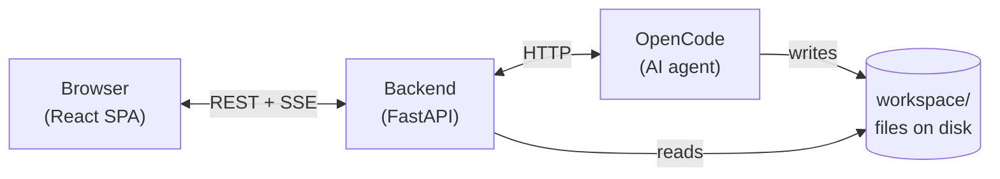

# Data Buddy

Data Buddy is an agent-driven data analysis tool. Upload a CSV, state what you want to learn, and the system profiles your data, drafts a structured analysis plan, and builds it section by section — each section producing a Python analysis, a chart, and a written interpretation.

```
TODO: add a GIF showing the app in action
```

The analysis is done by [OpenCode](https://opencode.ai), an AI coding agent that calls to external LLM APIs. The backend orchestrates what OpenCode does and when; the frontend shows it happening in real time.

---

## Prerequisites

The recommended path is a **dev container** — it provides Python, Node, and all tooling automatically. On your host machine you need:

- **Docker** (or a compatible runtime)
- **VS Code** with the [Dev Containers extension](https://marketplace.visualstudio.com/items?itemName=ms-vscode-remote.remote-containers)
- **OpenCode** installed and authenticated on your host — see [opencode.ai](https://opencode.ai) for installation and OAuth setup

If running outside the dev container you will also need Python 3.12, [uv](https://docs.astral.sh/uv/), Node 22, and pnpm installed locally.

See [SETUP.md](SETUP.md) for the full environment checklist, including GitHub credential setup for the overnight agent workflow.

---

## Installation

Open the repo in the dev container, then run:

```bash
make install
```

This installs backend dependencies (via uv), frontend dependencies (via pnpm), pre-commit hooks, and Playwright browsers.

---

## Usage

```bash
make dev
```

This starts three servers:

- **FastAPI** on `http://localhost:8000` — the backend API
- **Vite** on `http://localhost:5173` — the frontend
- **OpenCode** on `http://localhost:4096` — the AI agent, spawned automatically by the backend on startup

Open `http://localhost:5173` in your browser and follow the five-stage workflow:

1. **Upload** a CSV file and type an aim — what you want to learn from the data.
2. **Profile** — the agent reads the dataset and summarises each column: type, statistics, and flags like `nullable` or `high_cardinality`.
3. **Plan** — the agent proposes 3–6 analysis sections. Edit titles, reorder, or drop sections before accepting.
4. **Build** — the agent writes and runs a Python analysis for each section, producing a chart and a written interpretation.
5. **Export** — download the completed brief as a Markdown document.

---

## Repository layout

```
data-buddy/
├── backend/               Python backend — FastAPI app, orchestrator, OpenCode client
├── frontend/              React SPA — stage views, hooks, types
├── workspace/             Runtime artefacts written by OpenCode (gitignored at runtime)
├── docs/                  Reference docs to provide context for dev agents
├── CLAUDE.md              Auto-loaded into every dev agent session — codebase orientation
├── CONTRIBUTING.md        The overnight agent workflow — branching, review, merge, security rules
├── DEV_STATUS.md          Live progress board — what is merged, in flight, or blocked
├── ADR.md                 Architecture decisions, including overnight calls
├── QA_LOG.md              QA defect ledger — each defect becomes a standing regression check
├── SETUP.md               One-time environment setup (dev container, credentials, branch protection)
└── .claude/               Dev agent role definitions and nightly dev orchestration commands
```

---

## How it works

### Components



The **backend** is the orchestrator — it decides when to prompt the AI and what to say. The **frontend** never talks to OpenCode directly. The **workspace** is the durable record of everything the AI produces: `profile.json`, `plan.json`, analysis scripts, charts, and section write-ups.

### The pipeline


| Stage | What the agent does |
|---|---|
| **Profiling** | Reads the CSV and writes `workspace/profile.json` — column types, value distributions, and dataset-level flags |
| **Planning** | Drafts 3–6 analysis sections, each with a title and hypothesis, written to `workspace/plan.json` |
| **Building** | For each section: writes a Python analysis script, runs it to produce a chart, then writes a Markdown interpretation |
| **Done** | All accepted sections are ready; `/export` assembles them into a single Markdown brief |

### How the frontend stays in sync

The frontend uses two communication channels, each suited to a different job:

| Channel | Used for | Why |
|---|---|---|
| **SSE stream** (`GET /events`) | Real-time notifications while a turn is running | Low latency; fires as soon as something happens |
| **REST** (`GET /state`) | The authoritative current state | Reliable; persists across page reloads and reconnects |

SSE events are signals — they tell the browser "something changed, go check." The browser always re-fetches `GET /state` for the ground truth rather than trusting the event payload alone. This means a dropped connection or a missed event never leaves the UI permanently out of sync — the next page load always recovers from `state.json`.

### The workspace as contract

The backend reads OpenCode's output from files on disk, not from the AI's conversational memory. Every prompt re-supplies full context from workspace files. This has two practical benefits:

- **Recovery** — if OpenCode stalls or crashes, a fresh session picks up exactly where it left off, because all context comes from files.
- **Testability** — the backend can be tested without a live AI by placing fixture files in `workspace/`.

---

### Agent-specific files

If you are here to run or extend the app, the files you need are `backend/`, `frontend/`, `workspace/`, and `Makefile`. The rest of the root-level files support the **overnight agent development workflow** — a multi-agent system where BE, FE, TL, and QA roles build and review the project autonomously:

| File / directory | Purpose |
|---|---|
| `CLAUDE.md` | Auto-loaded into every agent's context window; orients agents to the codebase |
| `CONTRIBUTING.md` | The agents' operating manual — branching model, review gate, security rules |
| `DEV_STATUS.md` | The TL agent's live progress board; updated each night |
| `ADR.md` | Architecture decisions; overnight calls are appended as `Proposed — pending review` |
| `QA_LOG.md` | QA's defect ledger; each entry includes a regression check |
| `.claude/agents/` | Role definitions for BE, FE, TL, and QA subagents |
| `.claude/commands/night.md` | The `/night` slash command that kicks off a run |
| `docs/planning/` | The static spec the agents work from — story backlog, operating model, QA plan |
| `docs/contracts/` | The interface contracts lanes code against; neither lane reads the other's internals |

---

## Configuration

| Variable | Default | Purpose |
|---|---|---|
| `WATCHDOG_TIMEOUT_SECONDS` | `60` | Seconds without an event before a stuck turn is aborted and a fresh session is created |
| `SKIP_OPENCODE` | unset | Set to `1` to start the backend without launching OpenCode (useful for UI development and CI) |
| `QA_FORCE_STALL` | unset | Set to `1` to simulate a stuck turn after the first event, for testing watchdog recovery |
