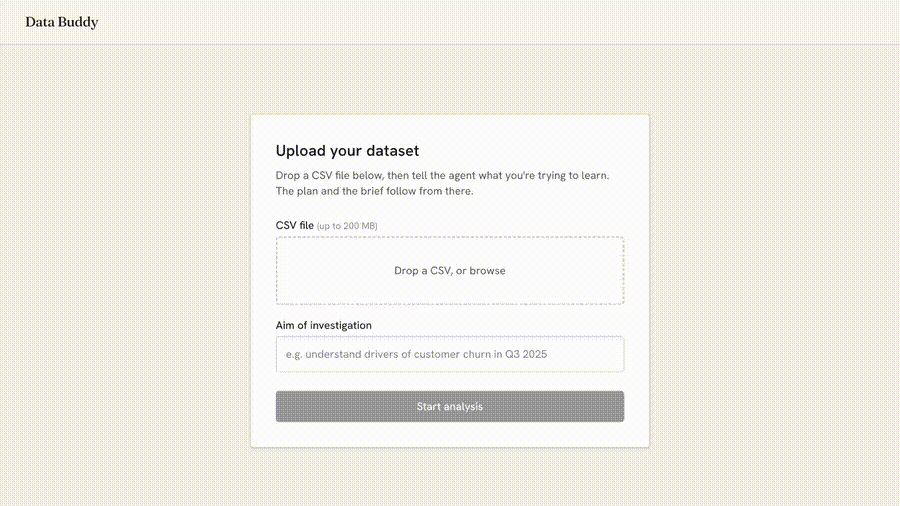
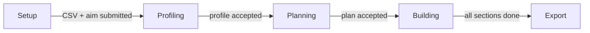
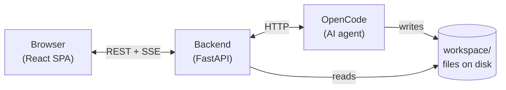

# Data Buddy

Data Buddy is an agent-driven data analysis tool. Upload a CSV, state what you want to learn, and the system profiles your data, drafts a structured analysis plan, and builds it section by section — each section producing a Python analysis script, a chart, and a written interpretation.



The analysis is done by [OpenCode](https://opencode.ai), an AI coding agent. The backend orchestrates what OpenCode does and when; the frontend shows it happening in real time.

## What this is really about
Data Buddy is a data analysis tool, but it demonstrates a bigger, generalisable pattern: **an opinionated agentic workflow where human-in-the-loop gates are structurally enforced**. A backend-orchestrated state machine ensures the agent cannot skip steps or proceed without explicit **human sign-off** at each boundary. The same architecture applies to any knowledge work process where sequence matters — Data Buddy is an instantiation in the data analysis context.
The rest of this README describes this implementation.

---

## Table of contents

- [Prerequisites](#prerequisites)
- [Quick start](#quick-start)
- [Workflow](#workflow)
- [Resetting between runs](#resetting-between-runs)
- [Development](#development)
- [Testing and linting](#testing-and-linting)
- [Environment variables](#environment-variables)
- [Repository layout](#repository-layout)
- [How it works](#how-it-works)
- [E2E evals](#e2e-evals)

---

## Prerequisites

| Requirement | Version | Notes |
|---|---|---|
| Python | 3.12 | Required by the backend |
| [uv](https://docs.astral.sh/uv/) | latest | Python package manager |
| Node.js | ≥ 18 | Required by the frontend |
| [pnpm](https://pnpm.io) | ≥ 8 | Frontend package manager |
| [OpenCode CLI](https://opencode.ai) | v1.15.10 | The AI agent runtime |
| OpenAI API key | — | Provider authentication for OpenCode |

**OpenCode authentication:** after installing OpenCode, run `opencode auth login openai` and follow the OAuth prompts. Your API key must be accessible to the OpenCode process — the simplest path is setting `OPENAI_API_KEY` in your shell environment before running `make run` or `make dev`.

---

## Quick start

```bash
# 1. Install all dependencies
make install

# 2. Set required environment variables
export OPENAI_API_KEY=sk-...

# 3. Build and run (single port: http://localhost:8000)
make run
```

Open `http://localhost:8000` in your browser, upload a CSV, type an aim, and follow the workflow.

---

## Workflow

Each stage represents a boundary where **human-in-the-loop sign-off** is required before the agentic workflow can proceed.



1. **Upload** a CSV file and type an aim — what you want to learn from the data. Example datasets are available in `data/`.
2. **Profile** — the agent reads the dataset and summarises each column: type, statistics, and flags like `nullable` or `high_cardinality`. Review the profile, then click Accept.
3. **Plan** — the agent proposes 3–6 analysis sections. Edit titles, reorder, or drop sections before accepting.
4. **Build** — the agent writes and runs a Python analysis for each section, producing a chart and a written interpretation. Accept, drop, or redirect each section.
5. **Export** — download the completed brief as a Markdown document containing the accepted sections in plan order.

---

## Resetting between runs

```bash
make clean
```

Removes `workspace/state.json`, `workspace/plan.json`, `workspace/profile.json`, `workspace/sections/`, `workspace/analyses/`, `workspace/charts/`, and `frontend/dist/`. Does NOT remove uploaded CSVs in `workspace/data/`. Run `make clean` before a fresh demo run.

After upgrading OpenCode, or if profiling immediately fails with an OpenCode schema-validation
error, stop Data Buddy/OpenCode and run:

```bash
make very-clean
```

This performs `make clean` and removes only OpenCode's SQLite session database
(`opencode.db` plus its `-shm` and `-wal` sidecars). It preserves OpenCode authentication,
configuration, and uploaded CSVs.

---

## Development

```bash
make dev
```

Runs two servers in parallel:

- **FastAPI** on `http://localhost:8000` — the backend API (with hot-reload)
- **Vite** on `http://localhost:5173` — the frontend (with HMR)

OpenCode is spawned automatically by the FastAPI backend on startup. Open `http://localhost:5173` during development. The Vite dev server proxies all `/api` requests to `:8000`.

---

## Testing and linting

```bash
make test    # runs pytest (backend) and Vitest (frontend)
make lint    # runs ruff (backend) and ESLint (frontend)
```

---

## Environment variables

| Variable | Required | Default | Purpose |
|---|---|---|---|
| `OPENAI_API_KEY` | Yes | — | OpenAI API key; passed to OpenCode for provider authentication |
| `WATCHDOG_TIMEOUT_SECONDS` | No | `60` | Seconds without an SSE event before a stuck turn is aborted and a fresh session is created |
| `SKIP_OPENCODE` | No | unset | Set to `1` to start the backend without launching OpenCode (useful for UI development and CI) |
| `QA_FORCE_STALL` | No | unset | Set to `1` to simulate a stuck turn after the first event, for testing watchdog recovery |
| `QA_FORCE_SECTION_FAIL` | No | unset | Set to `1` to force a section build to fail (for testing the retry/drop flow) |

---

## Repository layout

```
data-buddy/
├── backend/               Python backend — FastAPI app, orchestrator, OpenCode client
├── frontend/              React SPA — stage views, hooks, types
├── workspace/             Runtime artefacts written by OpenCode (gitignored)
├── docs/                  Architecture, contracts, planning docs
│   ├── ARCHITECTURE.md    Architecture overview and key design decisions
│   ├── contracts/         API and SSE contracts the backend and frontend integrate through
│   └── planning/          Story backlog and operating model (static spec)
├── Makefile               install / dev / run / test / lint / format / clean
├── CLAUDE.md              Auto-loaded into every dev agent session — codebase orientation
├── ADR.md                 Architecture decisions
└── DEV_STATUS.md          Live progress board
```

---

## How it works

The **backend** is the orchestrator — it decides when to prompt the AI and what to say. The **frontend** never talks to OpenCode directly. The **workspace** is the durable record of everything the AI produces.



For the full architecture including the state machine, session recovery model, and the backend-vs-agent split, see [`docs/ARCHITECTURE.md`](docs/ARCHITECTURE.md).

---

## E2E evals

End-to-end evals run the full pipeline on a CSV + aim pair, then use an LLM judge to score each built section against a golden brief. They live in `backend/evals/`.

**Prerequisites:** an `OPENAI_API_KEY` in your environment (the judge calls `gpt-5.4-mini`) and OpenCode on PATH.

### Running evals

Full run — build workspace from scratch, then judge all sections:
```bash
uv run --project backend python -m backend.evals.run_evals
```

See `--help` for more eval run options.

### Rubrics

Each built section is scored PASS/FAIL on five rubrics:

| Rubric | Passes when |
|---|---|
| `relevant` | The section directly addresses the stated aim |
| `uses_reasonable_fields` | The script uses relevant fields and avoids ID/irrelevant columns |
| `claims_supported_by_script` | Every claim in the writeup is based on analysis in the Python script |
| `claims_consistent_with_golden_brief` | Claims match known patterns and make no unsupported statements |
| `writeup_is_descriptive` | The writeup contains substantive, non-tautological findings beyond the original hypothesis |

The overall result is **PASS** only if every section passes every rubric.

### Adding a new eval case

1. Add your CSV to `data/`.
2. Add an entry to `backend/evals/test_cases.json` with the golden brief inlined — see the existing `tc001` entry for the shape.
