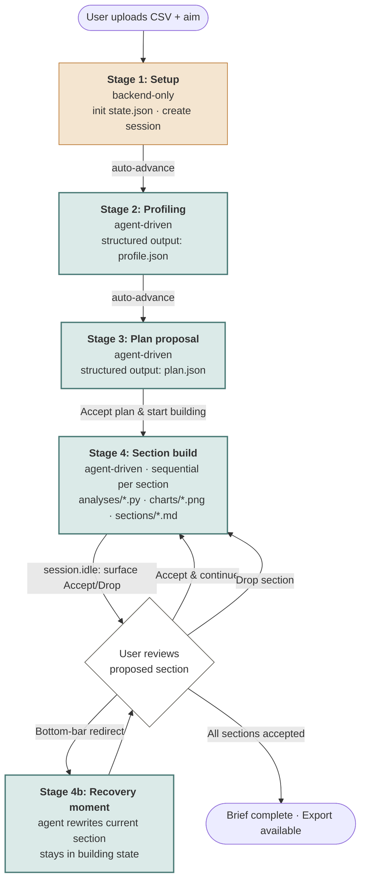
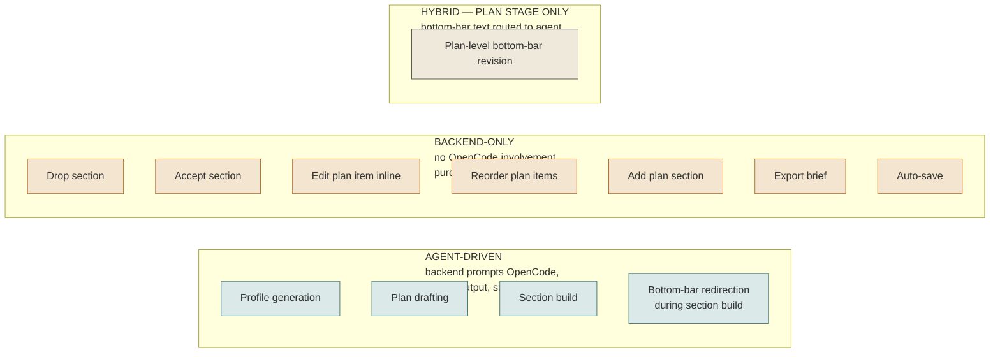
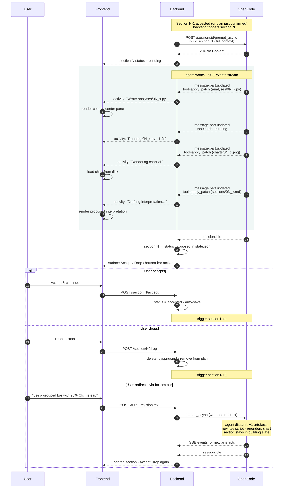

# Workflow Orchestration Model

*Companion to `design_handoff.md` and `cowork_mockups_stripped.html`. Last updated: 30 May 2026.*

## Purpose

The operational spec for how the backend drives OpenCode through the four-stage co-work flow. For each stage: what triggers it, what prompt the backend sends, what structured output it expects back, and which UI actions are agent-driven vs. backend-only. This is the contract the rest of the architecture (file schema, API surface, frontend state) hangs off.

## Scope change

Stages 5 (cross-cutting refinement) and 6 (snapshots) have been cut from the prototype scope. The deliverable is now four stages: Setup → Profiling → Plan proposal → Section build, with a recovery-moment sub-stage (4b) for mid-section redirection. The topbar shows "Auto-save" and "Export" chips but no snapshots panel.

## Framing assumptions

Carried in from earlier planning. Restated for self-containment.

- **Single OpenCode session per brief.** Backend creates one session at upload time, holds the ID, drives every turn against it. Sub-agents handled internally by OpenCode.
- **Backend-orchestrated, not agent-driven.** The backend decides when to prompt OpenCode and with what. OpenCode doesn't know what "stage" the user is in; that's the backend's job.
- **Structured output via `format: json_schema`** for anything the UI needs to render as structured data (plan items, profile).
- **Files are the contract** between backend and OpenCode. `analyses/*.py`, `charts/*.png`, `sections/*.md`, plus `state.json` owned by the backend.
- **Recovery pattern from the spike:** watchdog on 60s without events → abort; if abort doesn't resolve in ~10s → fall back to a fresh OpenCode session preserving logical state from `state.json`.

## The big picture

Four stages in a linear arc. The diagram marks agent-driven stages (green) vs. backend-only (orange). Stage 4b (recovery moment) is a sub-state of Stage 4, not a separate stage.



## Agent-vs-backend operation matrix

The split determines API surface: backend-only operations are simple HTTP endpoints with no async waiting; agent-driven operations need event-stream subscription. With refinement and snapshots cut, the matrix is leaner.



Note that the bottom bar changes character across stages. In Stage 3 it's fully agent-routed (the placeholder reads *"Tell the agent what to change about the plan"*). In Stage 4 it's section-scoped revision routed to the agent mid-turn. There is no post-build refinement loop in this scope.

## Stage-by-stage spec

### Stage 1 — Setup

**Trigger:** User uploads CSV and submits an aim.

**Backend actions (no OpenCode involvement):**
- Save CSV to `data/<filename>.csv` in the workspace.
- Initialize `state.json` with `aim`, dataset path, empty plan, empty sections, `stage: "profiling"`.
- Start `opencode serve` in the workspace if not already running.
- Create the OpenCode session via `POST /session`; store its ID in `state.json`.
- Auto-advance to Stage 2.

**Why no agent involvement yet:** The session exists but is idle. No reason to incur a turn before we know what to ask.

**Auto-save and reload recovery:** `state.json` is the single source of truth for reconstructing the UI after a browser refresh or tab close. The backend writes it after every meaningful state transition (section accepted, plan updated, stage advanced) and on a short periodic timer (~30s) during active agent turns. On page load, the backend reads `state.json` and returns the current stage, plan, section statuses, and profile — enough for the frontend to render exactly where the user left off. The "Auto-save · just now" chip in the topbar reflects the last successful write. The OpenCode session ID stored in `state.json` means an active turn that survived a backend restart can be reattached to; a turn that was mid-flight when the page refreshed is treated as failed and surfaced as a retry banner (see error handling below).

---

### Stage 2 — Profiling

**Trigger:** Stage 1 completes (auto).

**Prompt sent to OpenCode:**
> "A user has uploaded `data/<filename>.csv` with the stated aim: `<aim>`. Profile this dataset. Read the file, infer column types, compute distributions and summary statistics, identify the likely target variable if any, and flag data-quality issues. Return a structured profile."

**Structured output schema (via `format: json_schema`):**
```json
{
  "shape": {
    "rows": "int",
    "columns": "int",
    "nullsPercent": "float",
    "target": "string | null"
  },
  "columns": [
    {
      "name": "string",
      "type": "str | int | num | cat | date | bool",
      "summary": "one-line, e.g. 'median $42 · range $9–$4,200 · right-skewed'",
      "nullsPercent": "float",
      "flags": ["bimodal", "right-skewed", "long tail to 47"]
    }
  ],
  "flags": ["dataset-level concerns"]
}
```

**Backend handling:**
- Subscribe to SSE for this turn.
- Surface tool calls to the activity stream live (user sees "Loaded customers_q3.csv", "Sampled 200 rows", "Computed null counts", etc.).
- On structured-output completion, write `profile.json` to workspace and update `state.json`.
- Render the deterministic profile view (shape strip + per-column rows) from the JSON.
- Auto-advance to Stage 3 once the profile turn is idle.

**UI affordances:**
- Bottom-bar feedback before advancing: "cap support_tickets at p99" → backend sends as a new turn: *"The user has feedback on the profile: `<user text>`. Update the profile accordingly and return the revised structured profile."* Same schema applied; `profile.json` is overwritten.
- No explicit "accept" button on profiling — the user advances by interacting with the bottom bar or waiting.

**Why structured output:** Profile view is deterministic (fixed shape strip + per-column rows). The agent's contribution lives in the per-column `summary` string and the inferred `target`. Structured output eliminates formatting fragility.

---

### Stage 3 — Plan proposal

**Trigger:** Profiling turn reaches `session.idle` (auto-advance).

**Prompt sent to OpenCode:**
> "Given the aim `<aim>` and the profile `<profile.json contents>`, draft a structured analysis plan for this brief. Propose 3–6 sections. Each section has a title and a hypothesis to test. Methodology is left to you when the section is built. Return the plan as structured JSON."

**Structured output schema:**
```json
{
  "sections": [
    {
      "id": "sec_01",
      "title": "string",
      "hypothesis": "string"
    }
  ]
}
```

**Backend handling:**
- Write `plan.json` to workspace.
- Update `state.json` with the plan; mark all sections `status: "proposed"`.
- Render editable plan view. Plan items in dashed outline = proposed, unconfirmed.

**UI affordances — backend-only (no OpenCode):**
- Edit a section's title or hypothesis inline → write directly to `plan.json`
- Drop a section (× button) → remove from array in `plan.json`
- Reorder sections → shuffle array
- Add a section (+ add section row) → user types title + hypothesis, append to array

**UI affordances — agent-driven via bottom bar:**
- All bottom-bar text in this stage routes to the agent: *"User wants to change the plan: `<user text>`. Current plan: `<plan.json>`. Return a revised plan as structured JSON."* Full replacement, same schema.

**"Accept plan & start building" button** → backend-only; updates `state.json` stage to `"building"`, triggers Stage 4 for the first section.

**Why backend-only for inline edits but agent-driven for bottom bar:** Renaming or dropping a section is deterministic — no LLM needed, and it's faster. The bottom bar exists for cases that need reasoning ("make section 3 more specific", "add a section on geographic breakdown"). The mockup routes all bottom-bar text to the agent in this stage without distinguishing structural from semantic changes.

---

### Stage 4 — Section build

The most complex stage. Sequential per section; each produces three file artifacts. The sequence diagram shows one complete section lifecycle including the recovery-moment branch.



**Prompt sent to OpenCode (per section):**
> "Build section `<id>` of the brief: title `<title>`, hypothesis `<hypothesis>`. Aim: `<aim>`. Profile: `<profile.json>`. Dataset: `data/<filename>.csv`. Plan context: `<plan.json>` (sections before this one are already accepted).
>
> Write a Python analysis script at `analyses/<id>_<slug>.py`. Run it. Save any charts to `charts/<id>_<slug>.png`. Write the section as proposed text to `sections/<id>_<slug>.md` with a leading frontmatter block containing the chart filename and a one-paragraph interpretation.
>
> Use `apply_patch` for all file writes."

**Redirect prompt (Stage 4b, bottom-bar during active section):**
> "The user has redirected the current section `<id>` while it was building: `<user text>`. Discard any draft artefacts for this section and rebuild from scratch, applying the user's instruction. Same file targets: `analyses/<id>_<slug>.py`, `charts/<id>_<slug>.png`, `sections/<id>_<slug>.md`."

**No structured output at this stage.** Section structure is the file triplet: `.py` + `.png` + `.md` with frontmatter. The backend parses `.md` frontmatter deterministically. Forcing the whole section through a JSON schema would be awkward (chart is binary, code can be hundreds of lines).

**SSE event handling (shapes from the spike):**
- `message.part.updated` · `tool: "apply_patch"` → `state.metadata.files[]` gives path, type (add/modify), additions/deletions. Surface as activity line; read file from disk for render.
- `message.part.updated` · `tool: "bash"` → `state.input.command` for activity label; `state.output` for stdout on completion.
- `file.edited` → canonical "something changed" signal regardless of which tool wrote it.
- `session.idle` → auto-pause: surface Accept/Drop. Bottom bar label reads "§N building · auto-pause after".
- `message.part.delta` → optional: stream reasoning/text into a collapsible pane.

**Sequential, not parallel.** Accept triggers the next section's prompt. Keeps the event stream coherent and the user reviewing one section at a time — the core HITL mechanism of the prototype.

**Export** is available from Stage 4 onward (topbar chip). Backend-only: concatenate all `sections/*.md` files in plan order into a deliverable `.md`. No OpenCode involvement.

---

## What hangs off this spec

With the scope simplified, the next planning items are sharply bounded:

1. **File/state contract** — `state.json` schema, `plan.json` schema, section file naming conventions. Simpler now that there's no staged-diffs structure.
2. **API surface** — endpoints for backend-only operations (`POST /section/:id/accept`, `POST /section/:id/drop`, `POST /plan/update`, `GET /export`), plus the SSE proxy endpoint that forwards OpenCode events to the frontend.
3. **Prompt library** — three templated prompts (profile, plan, section-build) plus the redirect wrapper. Live in `backend/prompts/`.
4. **Watchdog implementation** — 60s no-event timeout, abort, fresh-session fallback. Applies to Stages 2, 3, and 4.

## Error handling

Three failure modes arise during agent-driven stages. They collapse to two UI patterns.

### Watchdog and structured-output retries

The watchdog fires if 60s passes with no SSE events. Any event resets the timer — tool events, `message.part.delta` reasoning chunks, `server.heartbeat`. This means OpenCode's internal structured-output retries (which do emit events) are invisible to the watchdog and don't trigger it. Only genuine stalls — provider timeouts, hung tool calls, lost SSE connection — trip the 60s threshold. On trip: abort the session; if abort doesn't resolve in ~10s, fall back to a fresh OpenCode session and surface a retry banner.

### Structured output failure / API error → retry banner

When a structured-output turn exhausts `retryCount` without producing valid JSON, or when a provider returns an error (timeout, rate limit, `AbortedError`), the backend surfaces an inline retry banner on the active stage pane. It does not block the whole UI. The banner names what failed ("Couldn't generate a plan — the model returned an unexpected response") and offers a single "Retry" action that re-sends the same prompt. No user data is lost in either case.

These two failure modes share the same UI pattern because the user's action is identical: retry. The framing of the message differs (model error vs. output format failure) but the recovery is the same.

### Bash tool error → agent-recovers-silently or agent-gave-up state

Script crashes inside a `bash` tool call are not OpenCode errors — they're non-zero exit codes that the agent observes in tool output and typically recovers from autonomously (rewriting the import, fixing the logic, retrying). The user should not see an error state during this; they see the agent working through it in the activity stream, which is the intended experience.

The failure state only surfaces if the agent gives up — exhausting its step budget, or emitting a text response indicating it can't fix the issue, followed by `session.idle` without a completed section triplet. The backend detects this by checking for the presence of `sections/<id>_<slug>.md` after `session.idle`. If the file is absent, the section is marked `status: "failed"` in `state.json` and a retry banner is shown: "The agent couldn't complete this section — retry or drop it." The user can retry (re-sends the section prompt) or drop (removes the section from the plan and advances).
